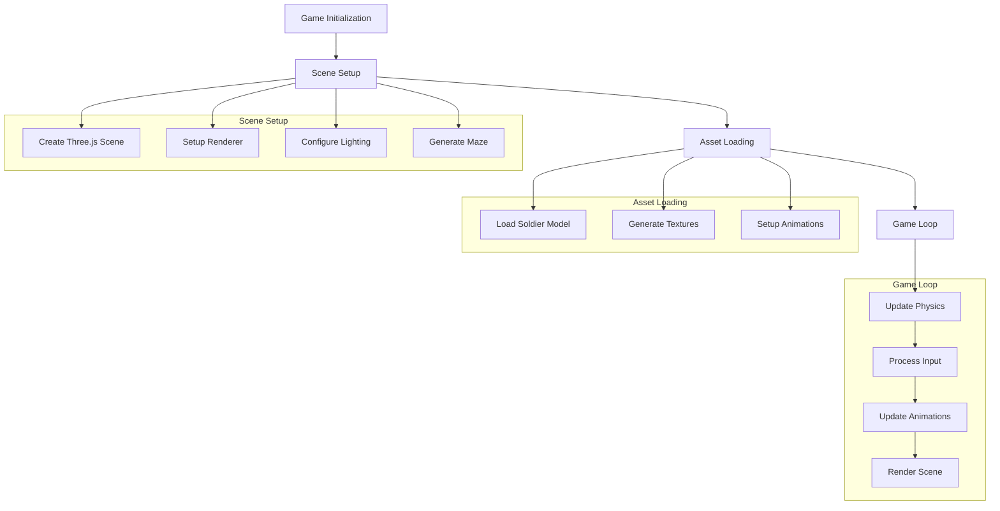
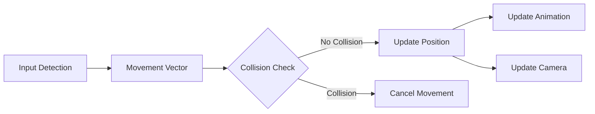
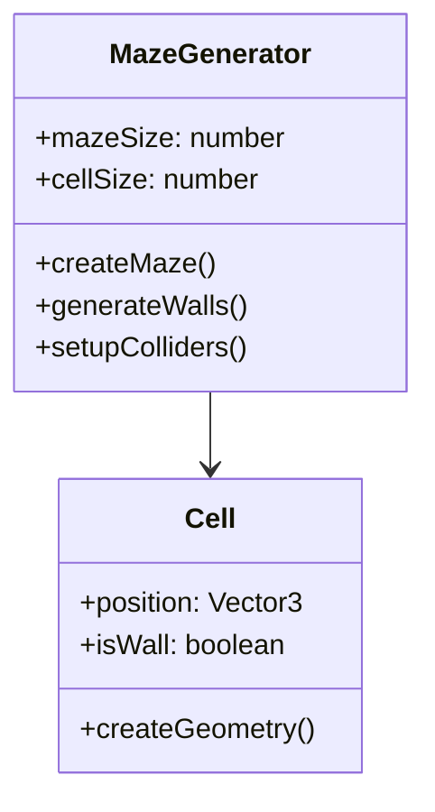
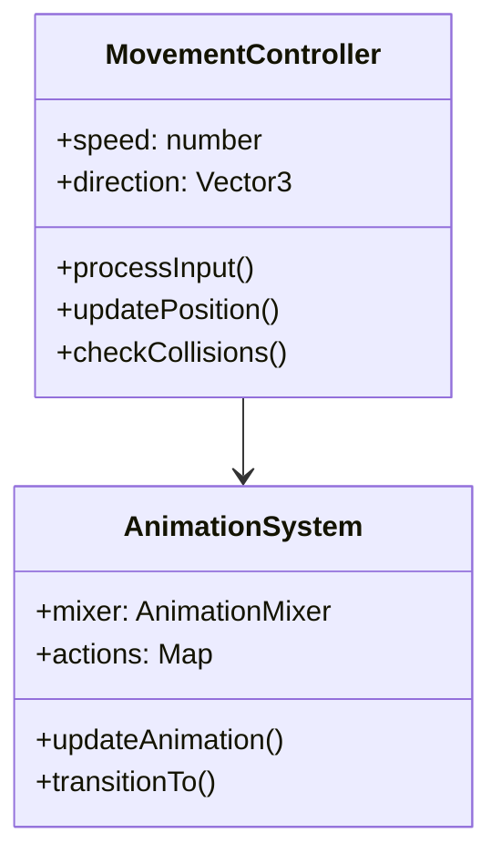
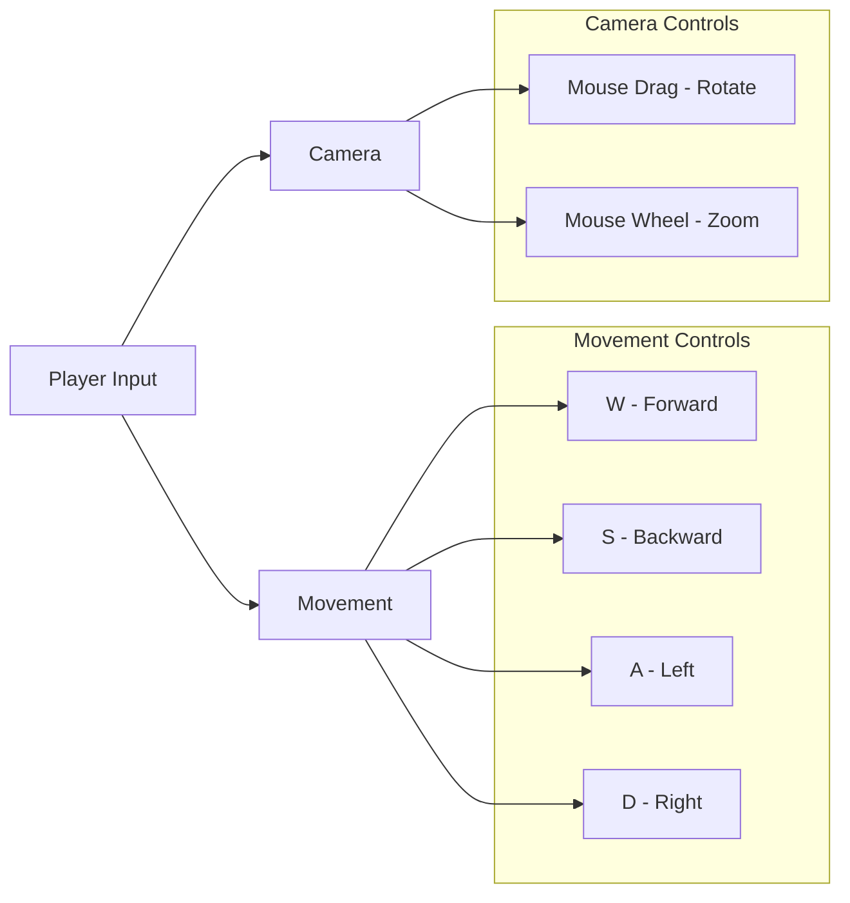
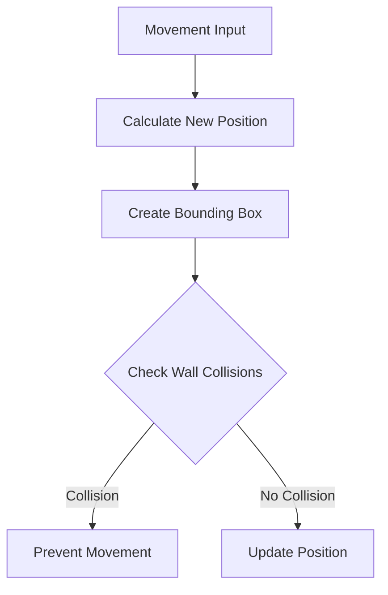
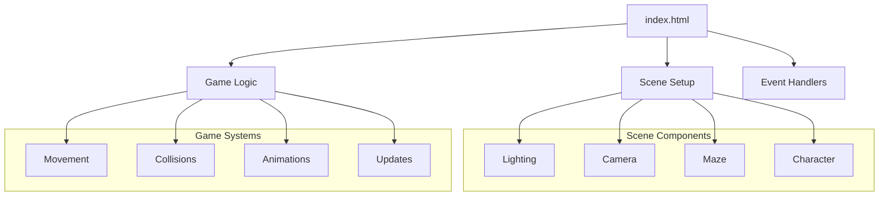
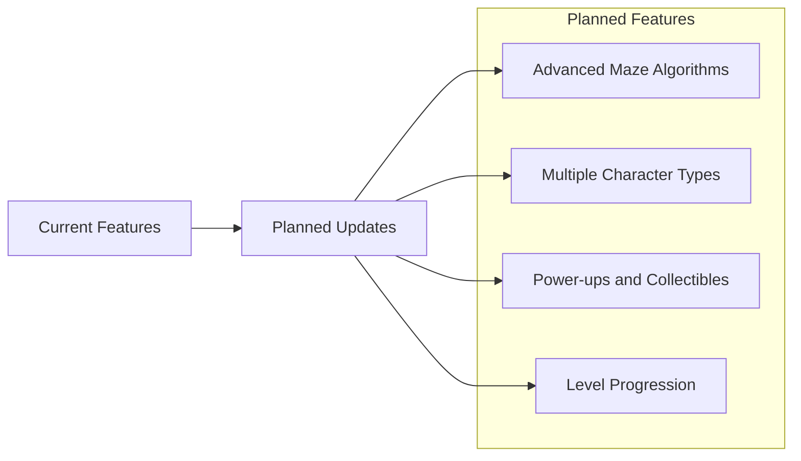

# 3D Maze Game Demo

A web-based 3D game featuring a procedurally generated maze and an animated soldier character, built with Three.js.

## Overview

This project demonstrates a 3D maze game where players control a soldier character through a procedurally generated maze environment. The game features smooth character animations, collision detection, and dynamic camera controls.

## Architecture

### Core Components Flow


### Movement System


## Implementation Details

### Core Technologies
- Three.js (r128) for 3D rendering
- GLTFLoader for model loading
- OrbitControls for camera management

### Key Features

#### 1. Procedural Maze Generation


#### 2. Character Control System


## Setup and Controls

### Installation
1. No installation required - runs directly in browser
2. All dependencies loaded via CDN:
   ```html
   <script src="https://cdnjs.cloudflare.com/ajax/libs/three.js/r128/three.min.js"></script>
   <script src="https://cdn.jsdelivr.net/npm/three@0.128.0/examples/js/loaders/GLTFLoader.js"></script>
   <script src="https://cdn.jsdelivr.net/npm/three@0.128.0/examples/js/controls/OrbitControls.js"></script>
   ```

### Controls


## Technical Features

### 1. Lighting System
- Ambient light for base illumination
- Hemisphere light for sky/ground contrast
- Directional light for shadows
- Point light for atmosphere

### 2. Texture Generation
- Procedurally generated textures for walls and floor
- Custom patterns and grid systems
- Dynamic material properties

### 3. Collision Detection


### 4. Animation System
- Smooth transitions between idle and run states
- Animation mixing for fluid movement
- State-based animation control

## Performance Optimizations

### 1. Rendering
- Efficient use of geometries and materials
- Proper disposal of unused resources
- Optimized render loop

### 2. Physics
- Simple but effective collision detection
- Optimized bounding box calculations
- Efficient movement calculations

### 3. Memory Management
- Texture reuse across similar objects
- Proper cleanup of unused resources
- Optimized asset loading

## Debug Features

The game includes a debug overlay showing:
- Current position (X, Y, Z)
- Rotation angle
- Movement state

## Code Structure

### Main Components


## Future Enhancements



## Contributing

Feel free to contribute to this project by:
1. Forking the repository
2. Creating a feature branch
3. Committing your changes
4. Opening a pull request

## License

This project is open source and available under the MIT License.

## Credits
- Three.js for 3D rendering engine
- Soldier model from Three.js examples
- Procedurally generated textures for maze elements
